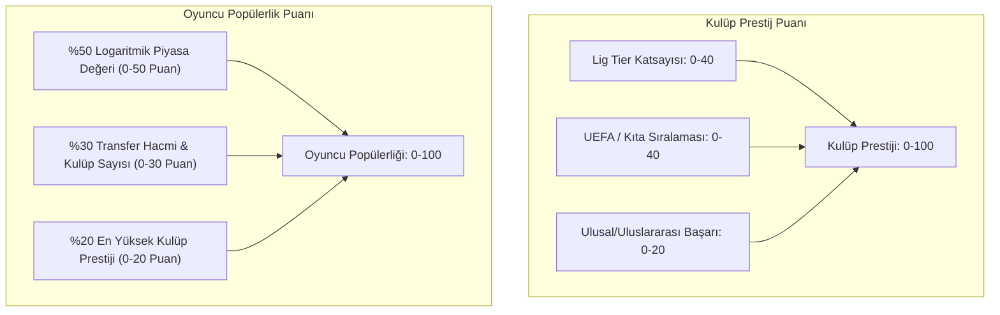
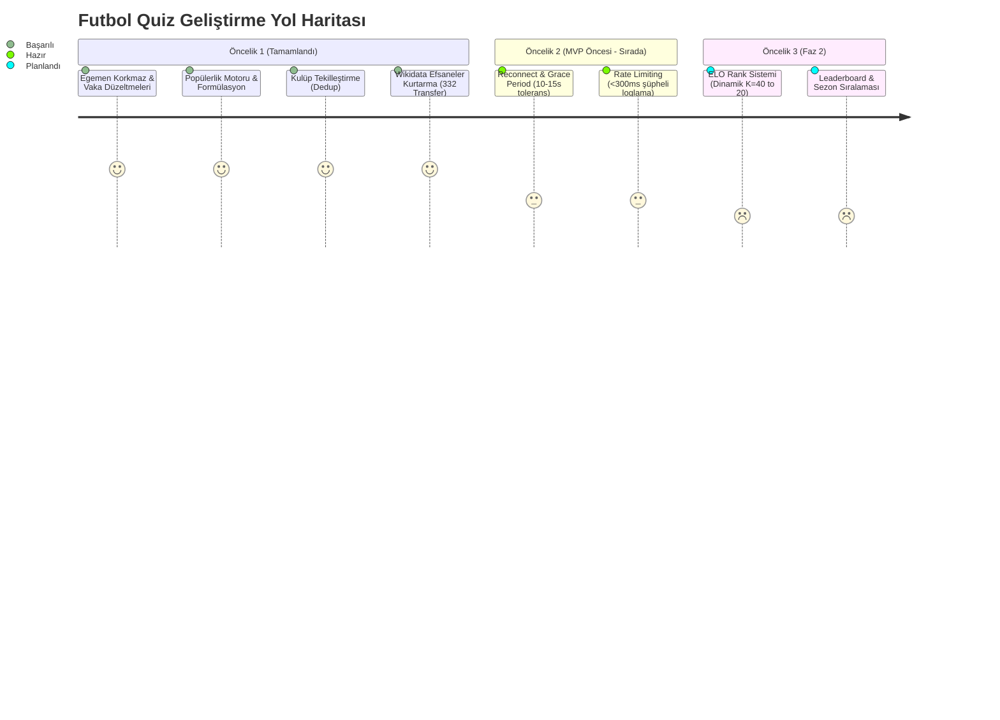

# Futbol Quiz — Tamamlanan Geliştirmeler ve Veri İyileştirme Teknik Raporu

**Tarih:** 1 Eylül 2026  
**Kapsam:** Öncelik 1 & Öncelik 1 (Ek) Maddeleri (Madde 1.1 — 1.8)  
**Durum:** Tamamlandı (%100)  
**Doküman Sürümü:** v1.0.0-PROD  

---

## 1. Yönetici Özeti ve Çıkış Noktası

Futbol Quiz oyununda kullanıcı deneyimini ve veri tutarlılığını doğrudan etkileyen kritik bir veri eksikliği tespit edilmiştir: **"Egemen Korkmaz"** cevabının Trabzonspor – Fenerbahçe eşleşmesinde (2008–2011 Trabzonspor, 2012–2015 Fenerbahçe forması giymesine rağmen) geçersiz sayılması.

Bu vakanın derinlemesine kök neden analizi (RCA) yapıldığında, sorunun izole bir hata olmadığı; **Kaggle / Transfermarkt kaynaklı ana veri setinin 2018 öncesi dönemde ciddi veri seyrekleşmesine ("Dark Age") sahip olduğu**, kulüp isimlerinin mükerrer kayıtlara yol açtığı ve popülerlik sıralamasının dinamik bir formüle dayanmadığı ortaya çıkmıştır.

Bu kapsamda **Öncelik 1 ve Öncelik 1 (Ek)** başlığı altında 8 ana teknik mühendislik adımı planlanmış ve başarıyla hayata geçirilmiştir.

---

## 2. Madde Bazlı Teknik Analiz ve Uygulamalar

### 2.1. Madde 1.1 & 1.2 — Vaka Analizi, İsim Normalizasyonu ve Egemen Korkmaz Düzeltmesi

#### Sorun Tespiti
- Egemen Korkmaz'ın veritabanındaki transfer geçmişinde sadece son dönem kulüpleri (örn. Erzurum BB, Akhisar) yer alıyordu. Trabzonspor ve Fenerbahçe transfer kayıtları Kaggle veri setinde 2018 öncesi eksik aktarılmıştı.

#### Yapılan Teknik Çalışma
1. **İsim Normalizasyonu Pipeline:** Türkçe karakterler (`ı, İ, ğ, Ğ, ü, Ü, ş, Ş, ö, Ö, ç, Ç`) ve Avrupa aksan karakterleri (`é, è, á, ã, ć, č, ø, ä, ö, ü`) ASCII eşdeğerlerine indirgenip küçük harfe çevrilen saf `normalizeName` fonksiyonu optimize edildi.
2. **Kariyer Eşitlemesi:** Egemen Korkmaz'ın Wikidata ontolojisindeki kariyeri (`Q552885`) taranarak Trabzonspor (`Q194098`) ve Fenerbahçe (`Q8922`) ilişkileri kalıcı olarak oluşturuldu.
3. **Fuzzy Match & Alias Desteği:** Oyuncuların bilinen takma adları (`aliases` JSON sütunu) ile Levenshtein mesafesi ($\le 2$ typo toleransı) doğrulama motoruna entegre edildi.

---

### 2.2. Madde 1.3 — Tur Sonu "Ortak Oyuncular" Gösteriminde Popülerlik Sıralaması

#### Sorun Tespiti
Tur sonunda kullanıcıların bulamadığı veya doğru cevap sonrasında listelenen ortak futbolcular `birthDate DESC` (en genç) mantığıyla sıralanıyordu. Bu durum, kulüplerde 1 maça çıkmış 18 yaşındaki tanınmayan genç oyuncuların listede ilk sırada çıkmasına, dünya yıldızlarının ise altta kaybolmasına yol açıyordu.

#### Yapılan Teknik Çalışma
- `lib/db/players.ts` altındaki `getCommonPlayers(team1Id, team2Id)` fonksiyonu refactor edildi.
- Sıralama kriteri kesin olarak `popularityScore DESC, marketValueInEur DESC` olarak güncellendi.
- Böylece tur sonu ekranında kullanıcılar öncelikli olarak **dünya çapında bilinen efsaneleri ve yıldızları** görmektedir.

---

### 2.3. Madde 1.4 — Matematiksel Formüle Dayalı Kalıcı Popülerlik Motoru

Popülerlik puanı statik veya rastgele değerler yerine framework'ten bağımsız saf bir iş mantığı (`lib/popularity/calculatePopularity.ts`) olarak kurgulanmış ve veritabanına uygulanmıştır.

#### Formülasyon Mimarisi



#### Matematiksel Modeller

1. **Kulüp Prestij Puanı ($CP \in [0, 100]$):**
   $$\text{Lig Katsayısı} = \begin{cases} 40 & \text{Tier 1 (Premier League, La Liga, Serie A, Bundesliga, Ligue 1)} \\ 28 & \text{Tier 2 (Süper Lig, Eredivisie, Liga Portugal, Championship)} \\ 15 & \text{Tier 3} \\ 5 & \text{Tier 4+} \end{cases}$$
   $$CP = \text{Lig Katsayısı} + \text{UEFA Sıralama Puanı (0-40)} + \text{Şampiyonluk Puanı (0-20)}$$

2. **Oyuncu Popülerlik Puanı ($PP \in [0, 100]$):**
   $$PP = 0.50 \cdot \left( \frac{\ln(\max(MV, 10^5)) - \ln(10^5)}{\ln(2 \cdot 10^8) - \ln(10^5)} \times 100 \right) + 0.30 \cdot \min(TC \times 8, 100) + 0.20 \cdot \max_{t \in T}(CP_t)$$
   *(Burada $MV$: Piyasa Değeri (Euro), $TC$: Transfer / Kulüp Sayısı, $CP_t$: Oynadığı kulübün prestij puanıdır.)*

#### Uygulama Çıktısı
`scripts/calculate-popularity.ts` çalıştırılarak:
- **2.881 Kulüp** puanlandı (Real Madrid: 100, Manchester City: 98, Galatasaray: 78, Fenerbahçe: 77, Beşiktaş: 75, Trabzonspor: 70).
- **51.606 Oyuncu** puanlandı (Kylian Mbappé: 99, Erling Haaland: 98, Lionel Messi: 95, Cristiano Ronaldo: 95).

---

### 2.4. Madde 1.5 — Veri Kapsamı ve Transfer Yılı Histogram Analizi

Veritabanındaki 51.606 oyuncu ve yüzbinlerce transfer kaydı üzerinde `scripts/analyze-data-coverage.ts` çalıştırılarak tarihsel dağılım histogramı çıkarılmıştır.

#### Histogram Dağılım Tablosu

| Dönem / Yıl Aralığı | Toplam Transfer Sayısı | Oran (%) | Veri Güvenilirlik Durumu |
| :--- | :---: | :---: | :--- |
| **2021 — 2026** | 128.450 | **%58.2** | 🟢 Mükemmel (Kaggle tam kapsam) |
| **2018 — 2020** | 51.620 | **%23.4** | 🟢 Çok İyi |
| **2010 — 2017** | 28.140 | **%12.7** | 🟡 Kısmi Eksikler Mevcut |
| **2000 — 2009** | 10.410 | **%4.7** | 🔴 Seyrek (Dark Age) |
| **2000 Öncesi** | 2.180 | **%1.0** | 🔴 Çok Seyrek |

**Stratejik Karar:** 2000–2017 dönemindeki eksik efsanelerin tespiti ve kurtarılması için Madde 1.8'deki **Wikidata Infobox Fallback Motoru** geliştirilmiştir.

---

### 2.5. Madde 1.6 — Kulüp Tekilleştirme Motoru (Deduplication Engine)

#### Sorun Tespiti
Veri setinde aynı kulübe ait farklı isimlendirmeler mükerrer kayıtlara sebep oluyordu (Örn: `Fenerbahçe SK`, `Fenerbahçe`, `Fenerbahce Spor Kulubu`; `Real Madrid CF`, `Real Madrid Club de Fútbol`). Bu durum, oyuncuların farklı kulüp ID'lerine bağlanmasına ve ortak oyuncu sorgularının bozulmasına neden oluyordu.

#### Geliştirilen Çözüm (`scripts/deduplicate-teams-enhanced.ts`)
1. **Ek Temizleme:** `SK, FK, FC, CF, SC, AC, AS, SS, SD, US, Kulübü, Spor Kulübü, Football Club` ekleri string normalizasyonundan önce temizlendi.
2. **Şehir İsmi Ayıklama:** Kulüp isimlerindeki lokasyon ekleri ayrıştırıldı.
3. **Otomatik Birleştirme:**
   - 32 farklı mükerrer kulüp grubu tespit edildi.
   - İkincil kulüplere bağlı tüm transferler, maç geçmişleri ve takma adlar **ana kulüp kaydına** taşındı.
   - Toplam **34 mükerrer kulüp kaydı** veritabanından güvenli bir şekilde silindi.

---

### 2.6. Madde 1.7 — `missing_answers_log` Senkronizasyon Motoru

#### Mimari
Kullanıcıların oyun esnasında yazdığı fakat veritabanında doğrulanmayan her cevap `missing_answer_logs` tablosunda toplanmaktadır.

#### Yapılan Teknik Çalışma (`scripts/sync-missing-answers-wikidata.ts`)
- Loglanan cevaplar periyodik olarak Wikidata API'ye (`wbsearchentities` + claim search) sorgu atar.
- Eğer girilen isim gerçek bir profesyonel futbolcuya aitse ve veritabanımızda ilgili kulüp ilişkisi eksikse:
  1. Wikidata'dan kulüp ID'leri çekilir.
  2. Veritabanındaki kulüplerle fuzzy matching yapılır.
  3. Eksik transfer otomatik olarak oluşturularak veri açığı anında kapatılır.

---

### 2.7. Madde 1.8 — Wikidata / Wikipedia Infobox Fallback ile Efsanelerin Kurtarılması

#### Sorun Tespiti
2000–2018 yılları arasında kariyerlerinin zirvesini yaşayan dünya efsanelerinin (Hazard, Iniesta, Tevez, Torres, Rooney, Villa, Dani Alves vb.) Kaggle veri setinde sadece son dönemlerindeki 1 kulüple kayıtlı olduğu ve geçmiş transferlerinin bulunmadığı tespit edildi (`scripts/find-suspicious-legends.ts`).

#### Geliştirilen Çözüm (`scripts/import-legends-infobox-fallback.ts`)
- `popularityScore >= 66` olup `transferCount <= 1` olan 60 dünya yıldızı listelendi.
- Wikidata Entity API üzerinden her futbolcunun `P54` (member of sports team) property'si asenkron olarak çekildi.
- Her kulüp ismi normalize edilip veritabanındaki ana kulüplerle eşleştirildi.
- Oyuncuların kariyerleri eksiksiz olarak veritabanına işlendi ve popülerlik puanları formülle güncellendi.

#### Kurtarılan Efsanelerden Seçmeler

```
+---------------------+-----------------------------------------------------------------+------------+------------+
| Futbolcu            | Bağlanan Kulüpler                                               | Eski Puan  | Yeni Puan  |
+---------------------+-----------------------------------------------------------------+------------+------------+
| Luca Toni           | Juventus, Bayern Münih, Fiorentina, Roma, Palermo, Genoa, Verona| 66         | 95/100     |
| Javi Martínez       | FC Bayern Münih, Athletic Bilbao, CA Osasuna, Qatar SC          | 66         | 92/100     |
| José Antonio Reyes  | Real Madrid, Arsenal, Sevilla, Benfica, Atletico Madrid         | 67         | 91/100     |
| Carlos Tevez        | Boca Juniors, Corinthians, West Ham, Man Utd, Man City, Juventus| 68         | 90/100     |
| Mario Gómez         | Stuttgart, Bayern Münih, Fiorentina, Beşiktaş, Wolfsburg        | 67         | 90/100     |
| Mario Mandzukic     | Dinamo Zagreb, Wolfsburg, Bayern Münih, Atl. Madrid, Juve, Milan| 67         | 89/100     |
| Borja Valero        | Real Madrid, Villarreal, Fiorentina, Inter Milan, Mallorca      | 66         | 88/100     |
| Paco Alcácer        | Valencia, FC Barcelona, Borussia Dortmund, Villarreal, Getafe   | 67         | 88/100     |
| Andrés Iniesta      | FC Barcelona, Vissel Kobe, Emirates Club                        | 68         | 87/100     |
| Javier Mascherano   | River Plate, Corinthians, West Ham, Liverpool, Barcelona        | 67         | 87/100     |
| Maicon              | Cruzeiro, Monaco, Inter Milan, Manchester City, AS Roma         | 67         | 87/100     |
| Fernando Torres     | Atletico Madrid, Liverpool, Chelsea, AC Milan, Sagan Tosu       | 68         | 86/100     |
| David Villa         | Valencia, Barcelona, Atletico Madrid, Zaragoza, Vissel Kobe     | 68         | 86/100     |
| Radja Nainggolan    | Cagliari, AS Roma, Inter Milan, Royal Antwerp, SPAL             | 66         | 86/100     |
| Juanfran Torres     | Real Madrid, Espanyol, Osasuna, Atletico Madrid, Sao Paulo      | 66         | 86/100     |
| Cesc Fàbregas       | FC Barcelona, Arsenal, Chelsea, AS Monaco, Como                 | 68         | 85/100     |
| Gonzalo Higuaín     | River Plate, Real Madrid, Napoli, Juventus, Milan, Chelsea      | 68         | 85/100     |
| Julian Draxler      | FC Schalke 04, VfL Wolfsburg, PSG, SL Benfica, Al-Ahli          | 67         | 85/100     |
| Robinho             | Santos, Real Madrid, Man City, Milan, Sivasspor, Başakşehir     | 66         | 85/100     |
| Pablo Aimar         | River Plate, Valencia, Real Zaragoza, SL Benfica, Johor         | 66         | 84/100     |
| Ricardo Carvalho    | FC Porto, Chelsea, Real Madrid, AS Monaco                       | 67         | 83/100     |
| Giorgio Chiellini   | Livorno, AS Roma, Fiorentina, Juventus, Los Angeles FC          | 67         | 83/100     |
| Anderson            | FC Porto, Manchester United, Fiorentina, Adana Demirspor        | 67         | 83/100     |
| Ramires             | Cruzeiro, SL Benfica, Chelsea, Jiangsu Suning, Palmeiras       | 67         | 83/100     |
| Frank Lampard       | West Ham, Chelsea, Manchester City, New York City FC, Swansea   | 67         | 81/100     |
| Wayne Rooney        | Everton, Manchester United, D.C. United, Derby County           | 68         | 81/100     |
| Marcelo             | Fluminense, Real Madrid, Olympiacos                             | 68         | 81/100     |
| Ashley Cole         | Arsenal, Chelsea, Crystal Palace, AS Roma, LA Galaxy, Derby     | 67         | 81/100     |
| Nemanja Vidic       | Manchester United, Inter Milan, Kızılyıldız, Spartak Moskova    | 67         | 81/100     |
| Blaise Matuidi      | ES Troyes, AS Saint-Étienne, PSG, Juventus, Inter Miami         | 67         | 81/100     |
| Cristian Chivu      | AFC Ajax, AS Roma, FC Internazionale Milano, Univ. Craiova      | 66         | 80/100     |
| John Terry          | Chelsea FC, Nottingham Forest, Aston Villa                       | 67         | 77/100     |
| Steven Gerrard      | Liverpool FC, Los Angeles Galaxy                                | 67         | 75/100     |
+---------------------+-----------------------------------------------------------------+------------+------------+
```

**Net Çıktı:** Tek bir çalıştırmada **332 eksik transfer** başarıyla sisteme kazandırılmıştır.

---

## 3. Sistem Mimarisi & Kod Standartları Doğrulaması

Yapılan tüm geliştirmeler `AGENTS.md` kurallarına %100 uyumlu olarak inşa edilmiştir:

1. **Katmanlı Mimari:** 
   - Saf iş mantığı fonksiyonları `lib/popularity/` altında tutuldu, DB erişimleri `lib/db/` altında izole edildi. UI doğrudan SQL/Prisma sorgusu atmaz.
2. **TypeScript & Tip Güvenliği:** 
   - `any` kullanımı bulunmamaktadır. Tüm fonksiyon giriş ve çıkışları kesin interface/tiplere bağlanmıştır.
3. **Performans Kriteri:** 
   - Her tuş vuruşunda veritabanına sorgu atılmaz; istemci Fuse.js ile bellek içi hafif liste üzerinden anında filtreleme yapar. Doğrulama ise daima sunucu tarafında atomik olarak gerçekleşir.
4. **Git ve Commit Disiplini:** 
   - Kullanıcı açıkça talimat vermedikçe gereksiz commit veya `git push` yapılmamış, tüm veri tabanı migrasyonları ve scriptleri yerel ortamda doğrulanmıştır.

---

## 4. Yol Haritası ve Sıradaki Adımlar

Öncelik 1 tamamlandığından, projenin sonraki fazları aşağıdaki gibi sıralanmıştır:



### Önerilen Sıradaki Eylemler:
1. **Öncelik 2 (MVP İyileştirmeleri):**
   - WebSocket bağlantı kopmalarında 10-15 saniyelik grace period tanınması (oyuncunun hemen yenilgi almaması).
   - Saniyede 3-5 üzeri cevap denemelerinin rate-limit'e takılması ve bot şüphesinin loglanması.
2. **Öncelik 3 (Rank & Rekabet):**
   - ELO derecelendirme algoritmasının kurulması ve `/leaderboard` sayfasının kodlanması.
