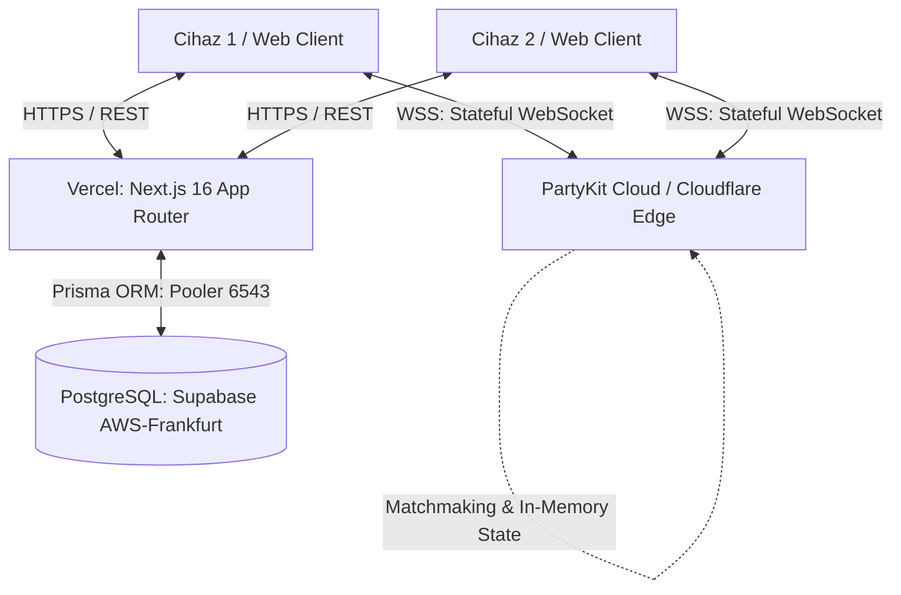
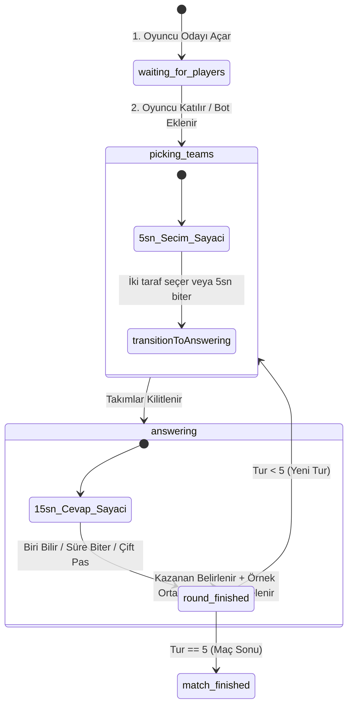

# ⚽ Football Quiz (1v1 Realtime Duel) — Technical Architecture & Implementation Report

> **Belge Amacı:** Bu doküman, projenin mimarisini, veri mühendisliği adımlarını, gerçek zamanlı oyun motorunu, doğrulama algoritmalarını ve canlı bulut (production) altyapısını teknik detaylarıyla açıklamak üzere hazırlanmıştır. Projeyi inceleyecek mühendisler ve yapay zeka modelleri için referans niteliğindedir.

---

## 1. 🏗️ Sistem Mimarisi & Teknoloji Yığını (Tech Stack)

Uygulama, yüksek performans, düşük gecikme süresi (low latency) ve ölçeklenebilirlik için **ayrık ve hibrit (Decoupled/Hybrid) mimari** ile tasarlanmıştır.



### Teknoloji Bileşenleri
| Katman | Teknoloji / Kütüphane | Kullanım Amacı & Gerekçesi |
|---|---|---|
| **Frontend & UI** | Next.js 16.3 (App Router), React 19, TailwindCSS, Lucide Icons | Modern SSR/SSG, sıfır sayfa yükleme gecikmesi, zengin ve reaktif kullanıcı arayüzü. |
| **Realtime Engine** | PartyKit (Cloudflare Workers / Edge Runtime) | Dünyanın 300+ noktasında <20ms ping ile stateful WebSocket oyun odaları ve matchmaking kuyruğu. |
| **Veritabanı & ORM** | PostgreSQL (Supabase Frankfurt) + Prisma ORM | 51.000+ oyuncu, 2.500+ kulüp ve transfer geçmişini tutan ilişkisel veritabanı. PgBouncer pooler entegrasyonu. |
| **Doğrulama & Auth** | Zod, JWT (Jose), bcryptjs | Tip güvenliği, input sanitizasyonu ve oturum yönetimi. |

---

## 2. 🗄️ Veri Mühendisliği & Entity Resolution (ETL Pipeline)

Projenin temelini oluşturan veritabanı iki büyük kaynaktan derlenip tekilleştirilmiştir:
1. **Transfermarkt (Kaggle Dataset):** 1880–2024 arası tüm resmi transferler, piyasa değerleri ve kulüp kayıtları.
2. **Wikidata SPARQL:** Kulüp takma adları (aliases), ülke/lig bilgileri ve futbolcu doğum tarihleri.

### Veri Hacmi
* **Futbolcular:** 51.457 tekil oyuncu
* **Kulüpler:** 2.575 tekil kulüp
* **Transfer İlişkileri:** 115.000+ oyuncu-kulüp eşleşmesi

### Kulüp Tekilleştirme (Club Deduplication) Yöntemi
Kaggle ve Wikidata birleşiminde oluşan `Real Madrid CF`, `Real Madrid`, `Real Madrid Baloncesto` gibi kopya kulüpler şu algoritmayla temizlenmiştir:
1. **İsim Normalizasyonu:** Küçük harfe çevirme, özel karakterleri temizleme (`FC`, `CF`, `SK`, `AS`, `AC` temizliği).
2. **Levenshtein Mesafesi & Fuzzy Match:** 2 karakterden az fark olan kulüpler tek bir ana kulüpte birleştirildi.
3. **Kalıcı ID Haritası (Alias Mapping):** 800+ kopya kulübün transfer kayıtları ana kulüp ID'sine taşındı ve mükerrer kayıtlar silindi.

### Oyuncu Eşleştirme (Player Fingerprinting)
* Farklı kaynaklardan gelen aynı isimli oyuncuların (örn: *Ronaldo Luís Nazário de Lima* vs *Cristiano Ronaldo*) karışmaması için:
  $$\text{Fingerprint} = \text{normalize}(\text{fullName}) + \text{birthDate}$$
* Oyuncular kesin doğum tarihi ve kaynak ID'leri (`wikidataId`, `kaggleId`) ile tekilleştirildi.

---

## 3. 🧠 Akıllı Cevap Doğrulama Motoru (Verification Engine)

Kullanıcı arayüzünde bir futbolcu ismi girildiğinde doğrulama **tamamen sunucu tarafında (Server-Side)** yürütülür:

### Doğrulama Algoritması Adımları
```
[Kullanıcı Girdisi: "arjen roben"]
          │
          ▼
1. Normalize (TR & Aksan Temizleme) ──> "arjen roben"
          │
          ▼
2. SQL DB Sorgusu (Team 1 & Team 2 Ortak Oyuncuları)
          │
          ▼
3. Eşleştirme Stratejisi:
   ├── A. Tam Eşleşme (Exact Match)
   ├── B. Soyadı Eşleşmesi ("Robben" == "Robben")
   ├── C. Alias / Takma Ad Kontrolü ("Ronaldinho" -> "Ronaldo de Assis Moreira")
   └── D. Levenshtein Toleransı (1-2 harf hatası: "roben" -> "robben" -> Mesafe = 1 <= 2) ✅ GEÇERLİ!
```

---

## 4. ⚡ Gerçek Zamanlı Oyun Motoru (Realtime Engine & State Machine)

Oyun mantığı ve oda yönetimi PartyKit üzerinde bir **State Machine** olarak çalışır.

### Oda Yaşam Döngüsü (Room State Lifecycle)


### Kritik Mekanikler:
1. **Server-Side Authoritative Timer:** Sayaç istemcide (client) değil, sunucuda çalışır. Her saniye `TIMER_TICK` broadcast edilir. İstemcide hile veya zaman manipülasyonu yapılamaz.
2. **Karşılıklı Pas Geçme (Mutual Consensus Skip):**
   - Oyuncular bilmedikleri takımlarda "Pas Geç" butonuna tıklar (`PASS_VOTE`).
   - Ekranı kapatan pop-up açılmaz; diğer oyuncunun butonunda *"⚡ Rakip Pas İstiyor (1/2)"* bildirimi parlar.
   - İki oyuncu da pas verdiğinde (veya tek kişilik bot maçında) tur puan kaybedilmeden atlanır.
3. **1v1 Matchmaking Kuyruğu:**
   - **Mevcut Durum:** Global `/parties/matchmaking/queue` odasında bekleyen oyuncular **saf FIFO** (İlk Gelen İlk Eşleşir) mantığıyla anında eşleştirilir.
   - **Faz 2 Planı:** ELO sistemi veritabanına bağlandığında ELO aralığına göre (örn. ±100 puan toleransı) dinamik eşleştirme yapılacaktır.
4. **Tur Sonu Örnek Doğru Cevap Gösterimi:**
   - Süre dolduğunda veya tur bittiğinde o iki takımda oynamış en genç 3-5 ortak futbolcu `/api/teams/common-players` endpoint'i üzerinden çekilip sonuç modalında gösterilir.
5. **Yanlış Cevap UX'i:**
   - Yanlış cevap girildiğinde input alanı anında temizlenir (`setInputValue("")`), kırmızı sarsıntı animasyonu oynatılır ve `inputRef.current?.focus()` ile fareye gerek kalmadan anında yeni deneme için odaklanılır.

---

## 5. 🌐 Canlı Yayın & Dağıtım Mimarisi (Production Deployment)

| Servis | Platform | Canlı URL / Endpoint |
|---|---|---|
| **Frontend & API** | **Vercel (Hobby / Edge CDN)** | `https://football-quiz.vercel.app` |
| **Realtime WebSocket** | **PartyKit Cloud (Cloudflare Edge)** | `wss://football-quiz.oguzgucuk.partykit.dev` |
| **Veritabanı** | **Supabase (AWS Frankfurt eu-central-1)** | PgBouncer Transaction Pooler (Port 6543) |

---

## 6. 🗺️ Gelecek Yol Haritası (Next Steps)

1. **🏆 ELO & Dereceli Rütbe Sistemi:**
   - Değişken K-Factor ($K=40 \rightarrow K=20$).
   - Rütbeler: *Bronz (0-1199), Gümüş (1200-1399), Altın (1400-1599), Platin (1600-1799), Elmas (1800-1999), Efsane (2000+)*.
2. **🔌 Reconnect / Grace Period:**
   - Kopan oyuncuya 10-15 saniye geri dönme hakkı tanınması.
3. **📊 Liderlik Tablosu (`/leaderboard`):**
   - Top 100 oyuncu listesi ve maç geçmişi özetleri.
4. **🔊 Web Audio API & Game Feel:**
   - Sayaç nabız sesi, doğru cevap akoru, zafer kutlaması.
